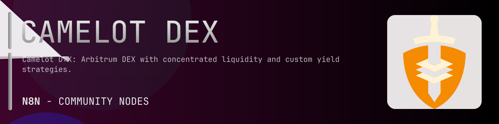

# @n8n-dev/n8n-nodes-camelot-dex



[](https://www.npmjs.com/package/@n8n-dev/n8n-nodes-camelot-dex)
[](https://opensource.org/licenses/MIT)

---

**Stop writing camelot-dex API integrations by hand.**

Every time you connect n8n to camelot-dex, you waste hours mapping endpoints, defining parameters, and debugging schemas. You copy-paste from docs, fix edge cases, and pray nothing breaks.

**What if connecting n8n to camelot-dex took 5 minutes, not half a day?**

This node gives you **24+ resources** out of the box: **Pools v2**, **Pools v3**, **Pools v3 Ticks**, **Pools v4**, **Deprecated Pools v4**, and 19 more: with full CRUD operations, typed parameters, and zero manual configuration.

---

## What You Get

- **Zero boilerplate**: Resources, operations, and fields are pre-configured and ready to use
- **Full CRUD**: Create, read, update, and delete support where the API allows it
- **Typed parameters**: No more guessing field types
- **Built-in auth**: API key authentication, ready to go
- **Declarative**: Native n8n performance, no custom execute() overhead

---

## Install

```bash
npm install @n8n-dev/n8n-nodes-camelot-dex
```

**Or in n8n:**
1. **Settings → Community Nodes → Install**
2. Search: `@n8n-dev/n8n-nodes-camelot-dex`
3. Click **Install**

---

## Quick Start

1. Install the node (above)
2. Add credentials: **camelot-dex API** → paste your API key
3. Drag the **camelot-dex** node into your workflow
4. Pick a resource → pick an operation → done.

That's it. No configuration files. No code. It just works.

---

## Resources

<details>
<summary><b>Pools v2</b> (1 operations)</summary>

- Get Retrieve V2 liquidity pools data

</details>

<details>
<summary><b>Pools v3</b> (1 operations)</summary>

- Get Retrieve V3 liquidity pools data

</details>

<details>
<summary><b>Pools v3 Ticks</b> (2 operations)</summary>

- Get Retrieve used ticks of a v3 pool
- Get Retrieve used ticks of a v4 pool

</details>

<details>
<summary><b>Pools v4</b> (1 operations)</summary>

- Get Retrieve V4 liquidity pools data

</details>

<details>
<summary><b>Deprecated Pools v4</b> (1 operations)</summary>

- Get Retrieve deprecated V4 liquidity pools data

</details>

<details>
<summary><b>Deprecated Pools v4 Ticks</b> (1 operations)</summary>

- Get Retrieve used ticks of a deprecated v4 pool

</details>

<details>
<summary><b>Tokens</b> (1 operations)</summary>

- Get Retrieve tokens data

</details>

<details>
<summary><b>Vaults</b> (1 operations)</summary>

- Get Retrieve vaults data

</details>

<details>
<summary><b>Campaigns</b> (1 operations)</summary>

- Get Retrieve campaigns data

</details>

<details>
<summary><b>Rewards</b> (1 operations)</summary>

- Get Retrieve rewards data

</details>

<details>
<summary><b>Points</b> (1 operations)</summary>

- Get Retrieve points data

</details>

<details>
<summary><b>Campaigns Health</b> (1 operations)</summary>

- Get Retrieve health data for campaigns

</details>

<details>
<summary><b>Metadata</b> (1 operations)</summary>

- Get Retrieve metadata from external source

</details>

<details>
<summary><b>Proofs</b> (1 operations)</summary>

- Get Retrieve proofs by type

</details>

<details>
<summary><b>Chains</b> (1 operations)</summary>

- Get Retrieve chains data

</details>

<details>
<summary><b>Health</b> (1 operations)</summary>

- Get Retrieve protocol health for one or all chains

</details>

<details>
<summary><b>Main Token</b> (1 operations)</summary>

- Get Retrieve Main Token data

</details>

<details>
<summary><b>Main Token Supply</b> (1 operations)</summary>

- Get Retrieve Main Token Supply data

</details>

<details>
<summary><b>X Token</b> (1 operations)</summary>

- Get Retrieve XToken data

</details>

<details>
<summary><b>Analytics</b> (3 operations)</summary>

- Get Retrieve analytics for every supported chain
- Get Retrieve aggregated analytics for every supported chain
- Get Retrieve analytics for the given chain

</details>

<details>
<summary><b>Analytics 24 H</b> (3 operations)</summary>

- Get Retrieve 24h analytics for every supported chain
- Get Retrieve last 24h aggregated analytics for every supported chain
- Get Retrieve last 24h analytics for the given chain

</details>

<details>
<summary><b>O Token</b> (3 operations)</summary>

- Get Retrieve OToken data
- Get Retrieve OToken rate history data
- Get Retrieve OToken conversions history data

</details>

<details>
<summary><b>Sales</b> (1 operations)</summary>

- Get Retrieve token sales data

</details>

<details>
<summary><b>Default</b> (15 operations)</summary>

- Get Pools v2 History Tvl
- Get Pools v2 History Volume
- Get Pools v2 History Fees
- Get Pools v2 History Txs
- Get Pools v2 History Price
- Get Pools v3 History Tvl
- Get Pools v3 History Volume
- Get Pools v3 History Fees
- Get Pools v3 History Txs
- Get Pools v3 History Price
- Get Pools v4 History Tvl
- Get Pools v4 History Volume
- Get Pools v4 History Fees
- Get Pools v4 History Txs
- Get Pools v4 History Price

</details>

---

## Why This Node?

**Without this node:**
- Hours of manual API integration
- Copy-pasting from camelot-dex docs
- Debugging auth, pagination, error handling
- Maintaining your own client code

**With this node:**
- Install → configure → use. 5 minutes.
- Auto-generated from the official camelot-dex OpenAPI spec
- Always up to date when the API changes
- Native n8n performance

---

## Auto-Generated
This node was auto-generated from the official **camelot-dex** OpenAPI specification using
[@n8n-dev/n8n-openapi-node-ultimate](https://github.com/kelvinzer0/n8n-openapi-node-ultimate),
then validated against the live API so you get accurate types and real parameters, not guesswork.

When the camelot-dex API updates, this node updates too.

---

## Support This Project

If this node saved you hours of work, consider supporting continued development, new APIs, better error handling, and faster updates.

[](https://n8n-code.github.io/membership/#/eyJ0aXRsZSI6IktlZXAgSXQgTW92aW5nIiwiZGVzYyI6Ik9uZSBkZXZlbG9wZXIgYnVpbHQgYSB0b29sIHRoYXQgYXV0by1nZW5lcmF0ZXNcbm44biBub2RlcyBmcm9tIGFueSBPcGVuQVBJIHNwZWMuXG5cbllvdXIgZG9uYXRpb24gZnVuZHMgbmV3IGZlYXR1cmVzLCBtb3JlIEFQSSBzdXBwb3J0LFxuYW5kIGJldHRlciB0b29saW5nIGZvciBldmVyeSBkZXZlbG9wZXIgYWZ0ZXIgeW91LiIsInRhcmdldCI6NTAwMCwiYWRkcmVzc2VzIjp7ImV0aGVyZXVtIjoiMHhmMDU1NWQ0MGRiRkI0ZTNCZjA3MDQ0MjgyQjc4RjJmRTFmNTFFZjcyIiwic29sYW5hIjoiNlpEVk5BYmpZZExEcXo4cGt3VUNHYllaNVV3QlFranB0QzU1Wk5vTFcybVUifSwiZGlzY29yZCI6Imh0dHBzOi8vZGlzY29yZC5nZy9wdERaOGU0aDkzIn0)

---

## License

MIT © [kelvinzer0](https://github.com/n8n-code)
